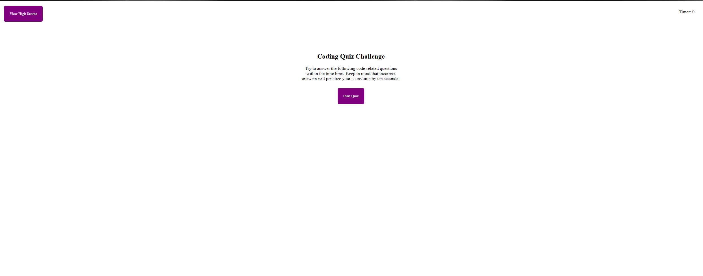

# <Coding Quiz>

## Description

A coding quiz that consist of 5 questions. The program allows for 1 attempt per question. JSON, Javascript, CSS, and HTML was used to create the application for users to enjoy a quick coding quiz that has a ranking system based on time left on the clock. 

## Installation

No installation required to use the website.

## Usage
Github Repository:https://github.com/Richard-Au1/CodingQuiz
Aplication Website: https://richard-au1.github.io/CodingQuiz/

Once the browser is open, the user will be greet with an introduction dialogue. Listed below

Once the user presses the start button then the quiz will begin with the first question. If the user press correctly, the quiz will move on to the next question with no time deduction. If the user presses incorrectly, then they will move onto the next question but have a 10 second deduction on the timer. The quiz ends once timer reaches 0 or the user finishes the quiz before the timer runs out. 

*Correct notification*

*Incorrect notification*

The user will then be brought to a highscore submitting page. The user will enter their name which will be saved to the local storage and then it will be posted onto the highscore page.

*Submission of Score*

On the highscore page the user can clear/view the highscore or go back to the quiz to try and get a better score. 

## Credits

The mentors I have had along the way.

## License

MIT License

Copyright (c) [2023] [Richard Au]

Permission is hereby granted, free of charge, to any person obtaining a copy
of this software and associated documentation files (the "Software"), to deal
in the Software without restriction, including without limitation the rights
to use, copy, modify, merge, publish, distribute, sublicense, and/or sell
copies of the Software, and to permit persons to whom the Software is
furnished to do so, subject to the following conditions:

The above copyright notice and this permission notice shall be included in all
copies or substantial portions of the Software.

THE SOFTWARE IS PROVIDED "AS IS", WITHOUT WARRANTY OF ANY KIND, EXPRESS OR
IMPLIED, INCLUDING BUT NOT LIMITED TO THE WARRANTIES OF MERCHANTABILITY,
FITNESS FOR A PARTICULAR PURPOSE AND NONINFRINGEMENT. IN NO EVENT SHALL THE
AUTHORS OR COPYRIGHT HOLDERS BE LIABLE FOR ANY CLAIM, DAMAGES OR OTHER
LIABILITY, WHETHER IN AN ACTION OF CONTRACT, TORT OR OTHERWISE, ARISING FROM,
OUT OF OR IN CONNECTION WITH THE SOFTWARE OR THE USE OR OTHER DEALINGS IN THE
SOFTWARE.

